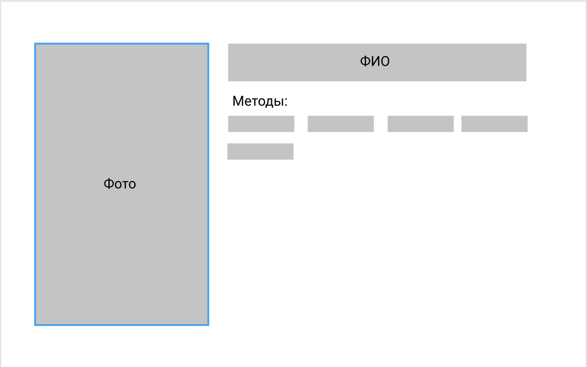

# Тестовое задание

## Требования

Есть таблица в Airtable со списком терапевтов: https://airtable.com/shrlHQArEK0WNdylo

1. Развернуть базовый проект по соответствующему стеку технологий.
2. Написать CLI скрипт, который будет выгружать данные из таблицы Airtable в PostgreSQL.
3. Этот же скрипт при повторном запуске должен определять:
    - появление новой записи в Airtable и догружать ее в базу данных
    - изменять уже существующие записи, если они изменились в Airtable
    - удалять записи, если их удалили в Airtable
4. При каждом запуске скрипта нужно сохранять в отдельную таблицу БД сырые данные из Airtable. Обязательные поля таблицы:
    - id (инкрементальный счетчик)
    - дата запуска
    - выгруженные данные
5. На фронтеде нужно создать страницу терапевта по приложенному мокапу, где будут отображаться все выгруженные данные по каждому терапевту

## Стек:

- Django + PostgreSQL
- DRF для быстрого создания REST-API
- Vue.js (требуемый по заданию)

## Структура проекта

1. Настройка окружения с помощью Docker
2. Фронтенд в папке frontend. Папка build является prod-версией, откуда django берет html и собирает статику.
3. meta - основная директория проекта django.
4. catalog - директория основного приложения. 
   - Вся базовая логика загрузки данных осуществляется через класс DataLoad и метод update_data(). Обновить данные можно 2 способами (кнопка на фронтенде или команда python manage.py updoc)
   - Для хранения данных использовано 4 модели - DataLoad, Doctor, Method, Photo.
   - 2 view для api (на базе простой функции для запуска загрузки данных и на базе DRF viewsets.ModelViewSet для api по врачам)
   
## Переменные окружения

**Подключение к базе данных:**

- POSTGRES_USER 
- POSTGRES_HOST
- POSTGRES_PASSWORD
- POSTGRES_PORT
- POSTGRES_DB

**Настройки Django:**

- DJANGO_SETTINGS_MODULE
- SECRET_KEY
- DEBUG

**Настройки airtable:**

- AIR_API_KEY
- AIR_APP

## Деплой и нюансы

[meta-test-mandrianova.herokuapp.com/](https://meta-test-mandrianova.herokuapp.com/)

Так как в Хероку нет возможности сохранять media-файлы в проекте и нужно настраивать хранение в AWS S3, то мне пришлось добавить ссылки на исходные url изображений и их же использовать на фронтенде.
При этом функционал сохранения фото я оставила, но с учетом деплоя он не работает так как нужно.

Так как нет доступа по api к нужной таблице airtable для разработки и демонстрации использовалась копия на моем аккаунте https://airtable.com/shrTzV2Rgg76rHMo5